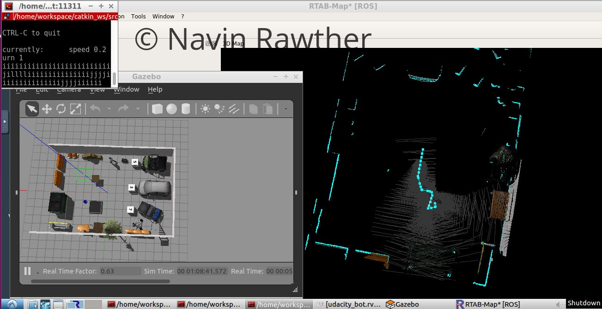

# RoboND-SLAM
Creating a 2D occupancy grid and 3D octomap for robots


----


## Writeup
Writeup is available [here](./SLAM_for_Robots.pdf).

## Steps to run
- Create catkin workspace
  Eg: 
  ```
  mkdir -p catkin_ws/src
  ```
  
- Clone the repository into the src folder
  ```
  cd catkin_ws/src
  git clone https://github.com/navinrahim/RoboND-SLAM.git
  cd ..
  catkin_make
  source devel/setup.bash
  ```
  

- Launch the robot in the world
  - For Kitchen World,
    ```
    roslaunch slam_project udacity_world.launch world_file:=/home/workspace/catkin_ws/src/
      RoboND-SLAM/udacity_bot/worlds/kitchen_dining.world
    ```
    
  - For Custom World,
    ```
    roslaunch slam_project udacity_world.launch world_file:=/home/workspace/catkin_ws/src/
      RoboND-SLAM/udacity_bot/worlds/custom_map.world.world
    ```
- Launch the teleop node to move the robot,
  ```
  roslaunch slam_project teleop.launch
  ```
  
- Launch mapping node to start mapping
  ```
  roslaunch slam_project mapping.launch
  ```
